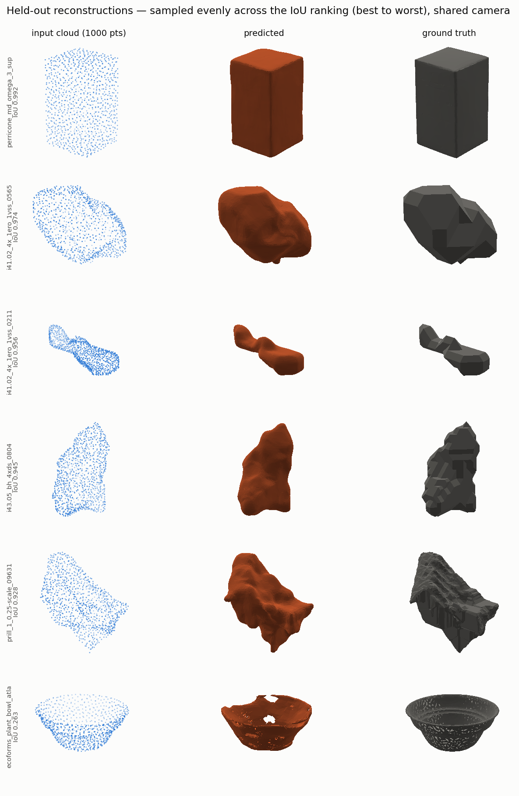
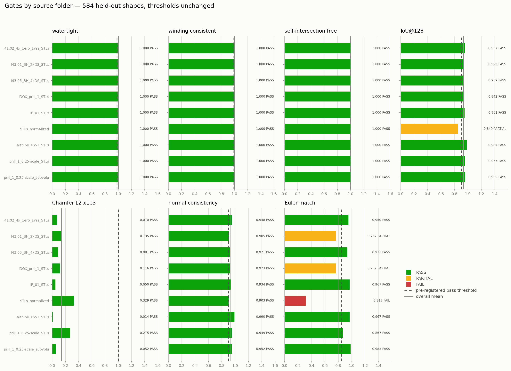

# pc2mesh

Point cloud → watertight triangle surface, optionally filled with tetrahedra.

## What this does

A 1000-point cloud with normals goes into a transformer encoder, which produces a
64-token latent set. A decoder cross-attends to that latent set and answers one
question per query point: is this point inside the shape? That gives a continuous
occupancy field, which is sampled on a 128³ grid and turned into a surface by
marching cubes at the 0 level set.

**The extractor guarantees watertightness, not the network.** Marching cubes on a
scalar field always emits a closed manifold, and the outer one-voxel shell of the
grid is forced to a large negative logit so the level set cannot run off the edge.
The network is free to be wrong about *where* the surface is; it is not able to
make the output open. That is why the watertight and winding-consistency rates are
1.0000 across 584 held-out shapes while IoU is 0.93 — those are measuring
different things, and only the second one is about the model.

After marching cubes the surface is decimated to 4,000 faces by quadric
decimation, re-checked after every step *and* after the STL is written, and
reverted whole to the undecimated mesh if any step costs watertightness or winding
consistency. A broken mesh is never written.



Six held-out shapes sampled evenly across the IoU ranking, best (0.992) to worst
(0.263) — the bottom row is the thin plant bowl that `examples/` ships.

## Install

```bash
pip install -r requirements.txt
```

Pinned to the versions the checkpoint was trained and scored with. Everything runs
**offline**: no weights are downloaded and no network call is made at any stage.
The checkpoint (`checkpoints/pc2mesh_v3.pt`, 24 MB) ships in this repository.

**CUDA is optional.** On the reference GPU (RTX 4070 laptop) one shape decodes in
~2 s; on 32 CPU cores the same shape takes ~35 s. Both produce watertight,
winding-consistent output. They are not bit-identical: CUDA runs the decode under
bfloat16 autocast and CPU runs float32, which moves the isosurface by a fraction of
a voxel and can change the face count by a handful out of ~45,000.

`gmsh` and `meshio` are needed only for `--tets`. Without them everything else
works and `--tets` says the backend is missing rather than substituting something
that is not a tetrahedral mesh.

## Quickstart

```bash
python main.py verify
python main.py infer --in examples/clouds --out /tmp/pc2mesh_out --tets
python -m pytest tests/ -q
```

`verify` checks the environment, the seven gate thresholds, the checkpoint, the
examples, and decodes one shape end to end. `infer` writes `surface/*.stl`,
`tets/*.vtu`, a per-shape `infer_report.csv` and an `infer_summary.json`; it takes
about 35 s for the five examples on a GPU. `pytest` runs 16 tests and needs no
prepared data.

`infer` also accepts a directory of `.stl` files (`--in examples/stl`), in any
units and any frame — each mesh is normalized and sampled first.

The five examples span the held-out IoU range from 0.25 to 0.99 and cover both
training domains. `ecoforms_plant_bowl_atlas_low` is the worst shape in the
held-out set and is included on purpose: its decimated surface has 16
self-intersecting face pairs, and `--tets` fails on it. That is the documented
failure path, not a broken install — see *Limits*.

### What inference reports

There is no ground truth at inference, so nothing is printed that needs one: no
IoU, no Chamfer, no Euler match. What is reported per shape is watertightness,
winding consistency, self-intersecting face pairs, face count, tet success — and a
`WARNING` if the normalized bounding box falls outside the training range (the grid
shell will clip whatever leaves it) or if the cloud does not carry exactly 1000
points.

Clouds with zero-norm normals are **rejected with the count and the reason**, not
repaired. A zero vector cannot be put on the unit sphere, so it would reach the
encoder off the manifold every other point is on.

## Using your own data

```bash
cp /path/to/your/*.stl data/stl/          # subdirectories become folder labels
python main.py prepare                    # normalize, sample, audit, build the cache
python main.py train                      # 60-minute budget by default
python -m pc2mesh.eval_gates --ckpt runs/<ts>/ckpt/best.pt --drop-floaters
```

`prepare` normalizes every mesh (centroid at the origin, max extent 1.0), samples
1000 points with face normals, audits that the clouds and meshes really share one
frame, and builds the occupancy cache and a 90/10 split taken *within* each folder.
Meshes that are still not watertight after the labeling repair are rejected with
the reason recorded in `data/corpus_build.csv` — the winding number cannot label
them, so they cannot supervise anything.

Put one source per subdirectory. The split and the gate report are both broken out
per folder, and that is the only way to see one domain's score being carried by
another's.

`main.py train --smoke` runs a 500-step overfit probe on 8 shapes first and
**refuses to proceed** unless the first probe shape comes out watertight with
IoU@128 ≥ 0.50. It is a real gate and it does say STOP.

Config is `pc2mesh/config.yaml`; nothing is hard-coded in the modules.

## The seven gates

Pre-registered before any result was seen, never relaxed. `tests/test_gates.py`
hard-codes them a second time so a silent edit fails a test. Values below are this
checkpoint on 584 held-out shapes at the shipped 4,000-face operating point.

| gate | threshold | measured | |
|---|---|---|---|
| watertight rate | ≥ 0.98 | 1.0000 | PASS |
| winding-consistent rate | ≥ 0.98 | 1.0000 | PASS |
| self-intersection-free rate | ≥ 1.00 | 0.9880 | PARTIAL |
| IoU@128 mean | ≥ 0.90 | 0.9335 | PASS |
| Chamfer-L2 ×10³ mean | ≤ 1.00 | 0.1403 | PASS |
| normal consistency mean | ≥ 0.90 | 0.9331 | PASS |
| Euler match rate | ≥ 0.85 | 0.7962 | PARTIAL |



The same seven gates broken out per source folder: the scanned-object row is the
only one that misses IoU and the only one that fails Euler.

Before decimation the marching-cubes output is self-intersection-free at 1.0000, so
the undecimated surface passes 6 of 7 and the 4,000-face surface passes 5 of 7.
Decimation is what introduces the self-intersections: quadric collapse has no
global intersection test, so a thin feature can be folded through itself. Every
affected mesh is still watertight and winding-consistent.

## What it was trained on

**[`docs/DATA_AND_MODEL.md`](docs/DATA_AND_MODEL.md)** is the full data and architecture
report for this checkpoint, read from the training run's own artifacts: all 22 discovered
source folders and which four were excluded on measured duplicate overlap, the
per-folder path from files on disk to cached shapes to train/val (6,050 selected − 209
rejected = 5,841 cached = 5,257 train + 584 val), the occupancy-label recipe and the
global bounding box, every architecture hyperparameter read out of the checkpoint's own
`model_cfg` with the 5,893,889 parameters split 5,053,440 encoder / 840,449 decoder, the
optimizer and schedule as run, and the shipped inference operating point down to the
gmsh version.

Anything the artifacts do not record is marked `NOT RECORDED` there rather than
reconstructed.

## Limits

**Euler match is PARTIAL (0.7962), and part of that is the ground truth.** Exact
Euler equality can be unreachable for reasons that have nothing to do with the
model: scanned-mesh ground-truth genus is frequently scan noise. One held-out
object's GT has Euler −180, i.e. genus 91, which is a statement about the scanner
and not about the object. Component match, reported beside it, is 0.8767. On the
scanned-object folder alone Euler match is 0.3173.

**Thin and multi-part shapes inflate.** The occupancy field is smooth and a thin
shell is the hardest thing for it to resolve, so those shapes come out thicker and
sometimes in more pieces than the target: 1.24 predicted components against 1.18 in
the ground truth overall, 1.87 against 1.63 on scanned objects. The worst held-out
shape is a thin plant bowl at IoU 0.2499, shipped in `examples/`.

**Training covers two domains: scanned consumer products and granular / crystal
particles.** 1250 of the former, 4800 of the latter (600 geometry-deduplicated
shapes from each of eight sources). The 0.9336 aggregate is carried by the
particles, and the particles are also an easier measurement: their ground truth is
a coarsely voxelized segmentation with a median of 386–5,604 faces against the
scanned objects' 11,462, and across all 584 held-out shapes the rank correlation
between ground-truth face count and IoU is **−0.58**. The scanned-object folder
alone scores 0.8489 (PARTIAL). How much of the headline is the model and how much
is the target having less detail to miss is not separable from this experiment.

**Far out-of-distribution input produces a confident blob.** The decoder always
returns a field and marching cubes always closes it, so there is no input for which
this pipeline outputs "I don't know" — it outputs a watertight surface. The bbox
`WARNING` is the only automatic signal, and it only catches inputs that are the
wrong *size* for the grid, not inputs that are the wrong *kind* of object.

## Layout

```
main.py                  prepare | train | infer | verify
pc2mesh/config.yaml      every tunable constant
pc2mesh/prepare.py       data/stl/ -> normalized meshes + sampled clouds
pc2mesh/pair_scan.py     frame audit; writes the manifest and the global bbox
pc2mesh/prep_queries.py  occupancy labels (igl winding number) + the 90/10 split
pc2mesh/model.py         encoder / decoder
pc2mesh/dataset.py       GPU-resident cache and the augmentation
pc2mesh/train.py         training + the smoke gate
pc2mesh/meshify.py       logit field -> marching cubes
pc2mesh/remesh.py        decimation with revert-on-break
pc2mesh/tetrahedralize.py  gmsh, per closed shell
pc2mesh/eval_gates.py    the seven gates, against ground truth
pc2mesh/plots.py         the figures in docs/, from a run's own logs and meshes
pc2mesh/infer.py         no ground truth: topology and OOD flags only
pc2mesh/verify.py        self-check
checkpoints/             pc2mesh_v3.pt (24 MB), carrying its own training bbox
examples/                5 STL/cloud pairs spanning the held-out IoU range
docs/                    figures + DATA_AND_MODEL.md; docs/README.md regenerates them
tests/                   augmentation invariants and gate integrity
```

More figures — per-folder IoU distributions, and what the face budget costs
against the undecimated output — are in [`docs/`](docs/README.md), along with how
to regenerate all of them from your own run with `python main.py figures --run
runs/<ts>`.

Everything under `data/` other than `data/stl/` is generated by `prepare` and is
gitignored.
